<div align="center">

# aura

**An ambient care simulator for assisted living.**<br>
Passive room signals become graded, explainable, human-acknowledged responses. The resident never wears or operates anything.


[Quick start](#quick-start) · [How it works](#how-it-works) · [The stories](#four-residents-four-stories) · [Full model and limits](docs/how-it-works.md) · [Releases](https://github.com/muratbaturay/aura/releases)

</div>

<br>

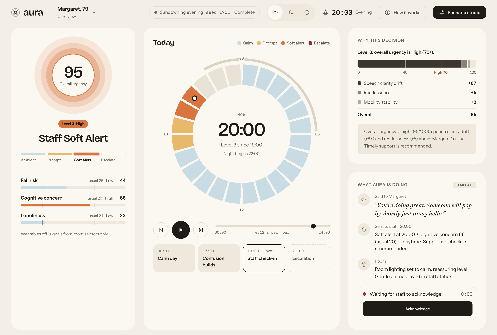

<p align="center"><sub>Margaret, 79, early dementia. <em>Sundowning evening</em> at 20:00: her speech has drifted well past her own normal, so AURA has alerted staff and is waiting for someone to acknowledge.</sub></p>

> [!IMPORTANT]
> AURA is a **prototype of the decision architecture** for ambient care, built for demonstration and research. It is **not a medical device**. The model is deliberately simple so that every decision can be traced by hand. Its weights are illustrative, not fitted to outcome data. [How it works, and its limits →](docs/how-it-works.md)

## Why AURA

Most care alerting systems answer one question: *is this number high?* In assisted living that question fails in both directions:

- A frail resident's normal is already "high risk". Absolute thresholds prompt them every hour, and staff learn to ignore the alarm.
- A small change in a steady resident, such as new confusion overnight (often the first sign of a UTI), stays below every threshold until it's serious.

AURA asks a different question: **how far is this person from their own normal, right now, at this hour?** It then answers in a way staff can trust:

| | |
|---|---|
| 🧍 **Personal** | Each resident has their own usual levels, night-time habits and care-plan targets. Alerts respond to *change from usual*, not to absolute risk. |
| 🚩 **Safe** | Absolute red flags put a floor under urgency whatever a resident's normal: vitals outside their care-plan targets, a bed-exit alert, being very unsteady while up at night, or hours out of bed. |
| 🔍 **Explainable by construction** | Every decision names the rule that set its level. A single bar splits the urgency into what rose above usual, and the parts add up exactly to the score. |
| 🪜 **Graded** | Four steps, from a change in the room's lighting up to escalation, so the smallest response that works is the one used. |
| 🤝 **Human in the loop** | Every staff alert waits for a person to acknowledge it, with a live timer. |
| 🔁 **Reproducible** | Every simulated day is seeded. The same seed replays the same day exactly, which makes demos and tests deterministic. |

## A tour

<table>
<tr>
<td width="50%" valign="top">

**Why this decision**

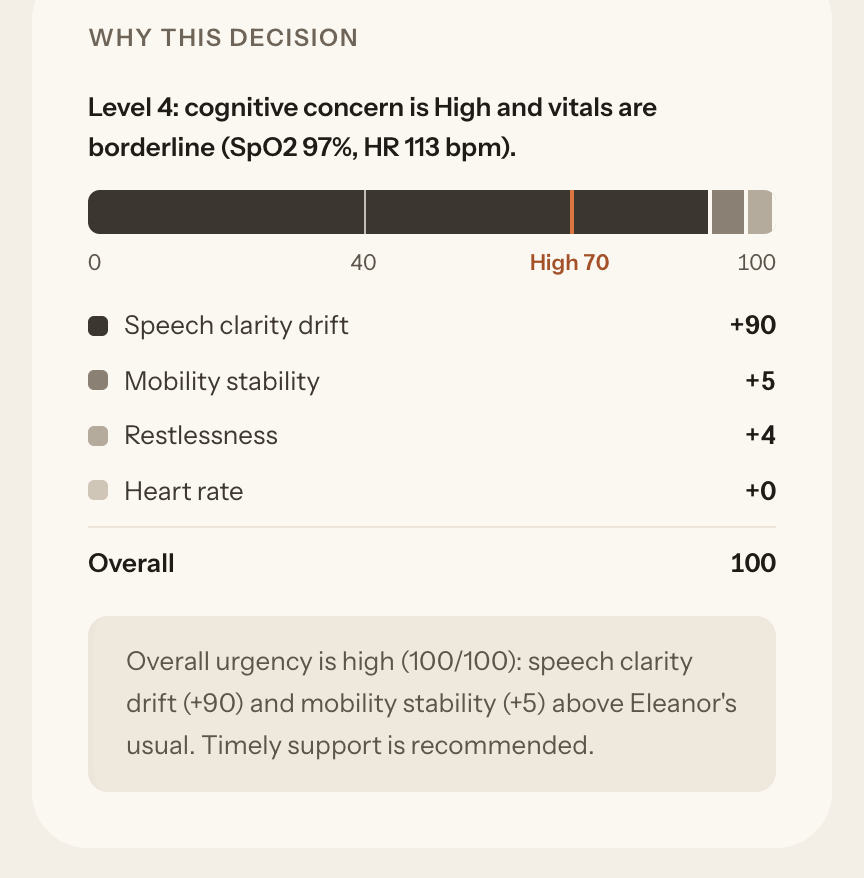

The rule that set the level, then the urgency as one bar made of the things that rose above the resident's usual. The segments are the model's own additive terms, so they always add up to the score.

</td>
<td width="50%" valign="top">

**What AURA is doing**

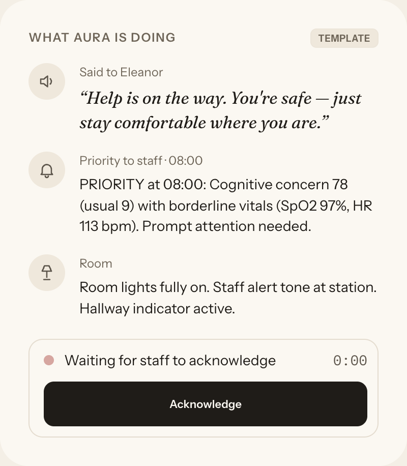

What was said to the resident, what was sent to staff and what changed in the room. A staff alert waits to be acknowledged, and the time it took is recorded.

</td>
</tr>
<tr>
<td width="50%" valign="top">

**The day as a dial**

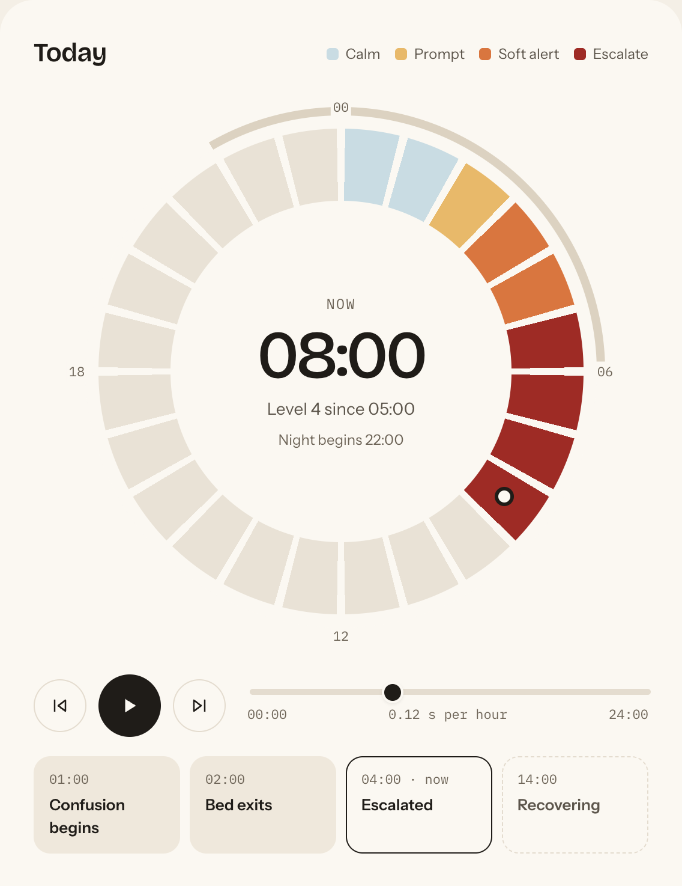

One slice per hour, coloured by the level reached. Night hours are marked on the outer arc. You can play, pause, step, scrub, or jump to a story chapter.

</td>
<td width="50%" valign="top">

**Four residents, four normals**

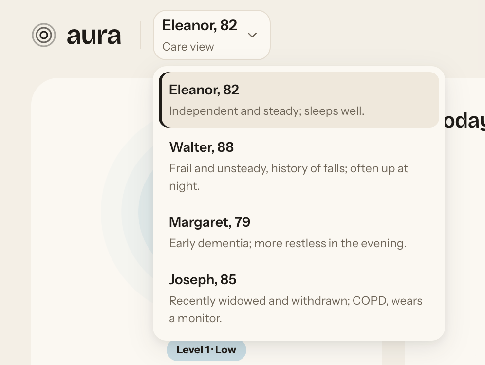

Switch resident from the header. Each has their own usual levels, night-time wake-ups, care-plan flags and vitals targets.

<br>

**On a phone**

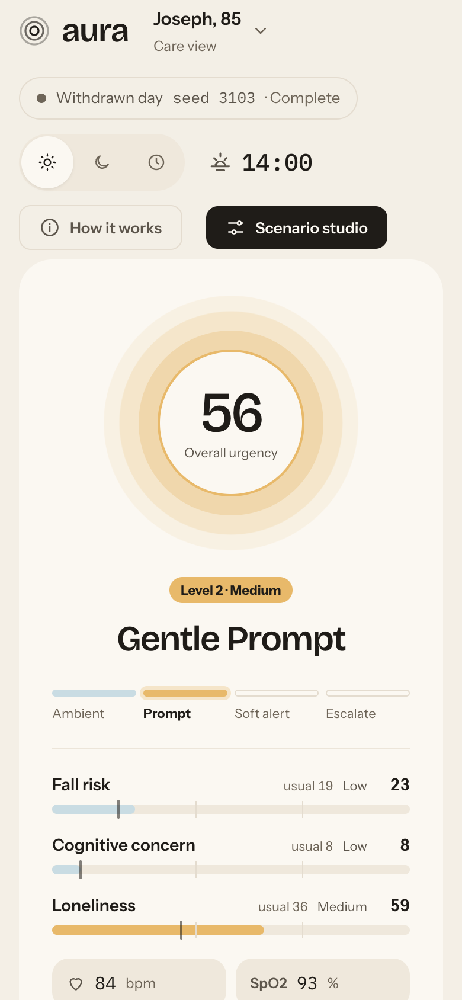

</td>
</tr>
</table>

### The day log

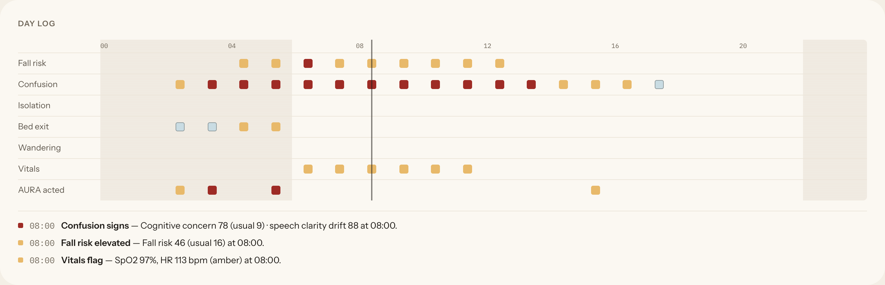

Every hour's events sit in lanes, with severity shown by colour and night hours shaded. Every hour at Level 2 or above has at least one mark explaining it, and *AURA acted* records each prompt, staff alert and escalation. Click a mark to jump to that hour and read what happened there in plain text.

### Night, in the dark theme

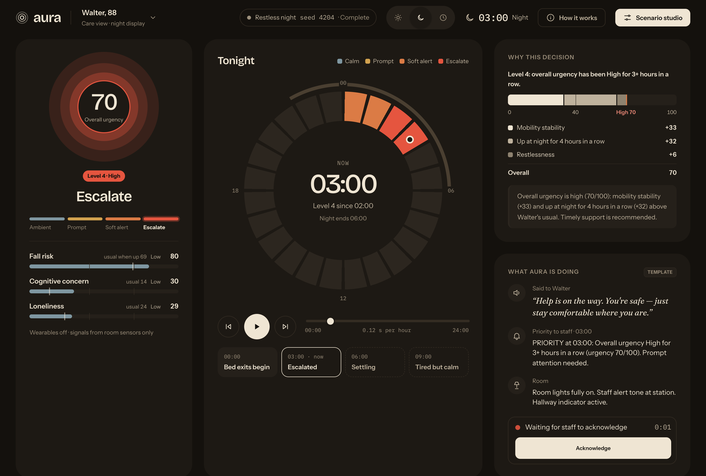

<p align="center"><sub>Walter, 88, frail with a history of falls. <em>Restless night</em> at 03:00: four hours in a row out of bed trip a red flag, and night-time fall risk is compared with his usual <em>when up</em>, so one bathroom trip is not an alarm.</sub></p>

Choose **Light** (the default), **Dark** (dim, warm and safe to use at night) or **Follow the clock** (dark from 22:00 to 06:00). The choice is remembered.

<table>
<tr>
<td width="38%" valign="top">

**Scenario studio**

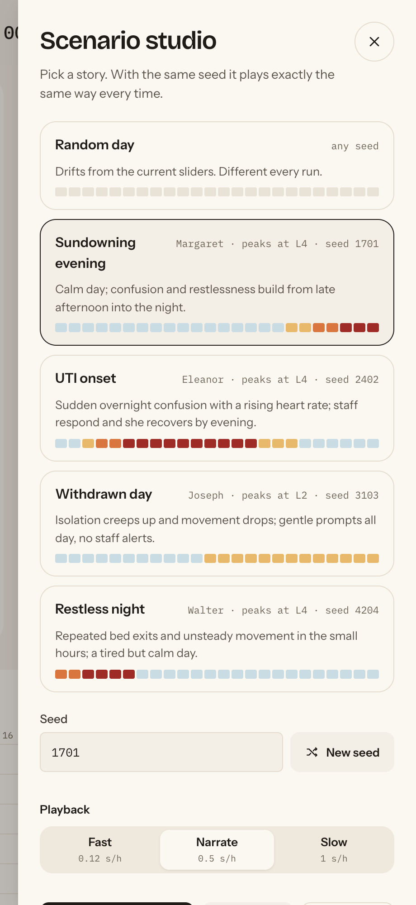

</td>
<td width="62%" valign="top">

**How it works, inside the app**

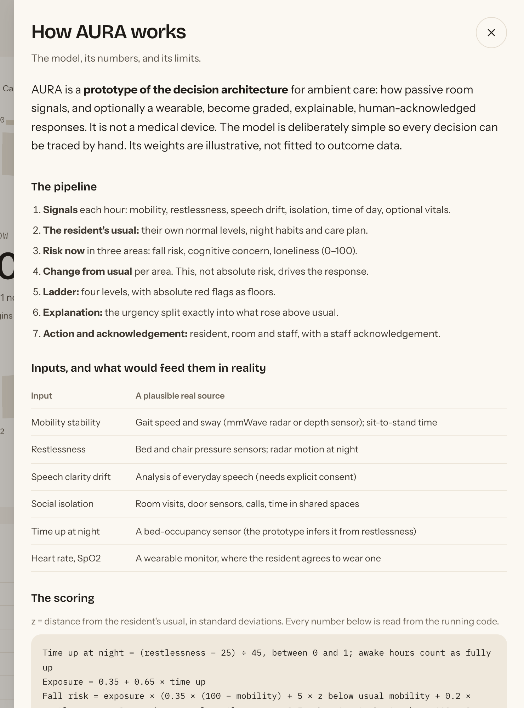

Every formula, threshold and resident profile in this panel is **read from the running code's own constants**. A test checks that [docs/how-it-works.md](docs/how-it-works.md) matches them too, so the explanation can't drift from what the code does.

</td>
</tr>
</table>

<details>
<summary><strong>The whole page</strong> (click to expand)</summary>

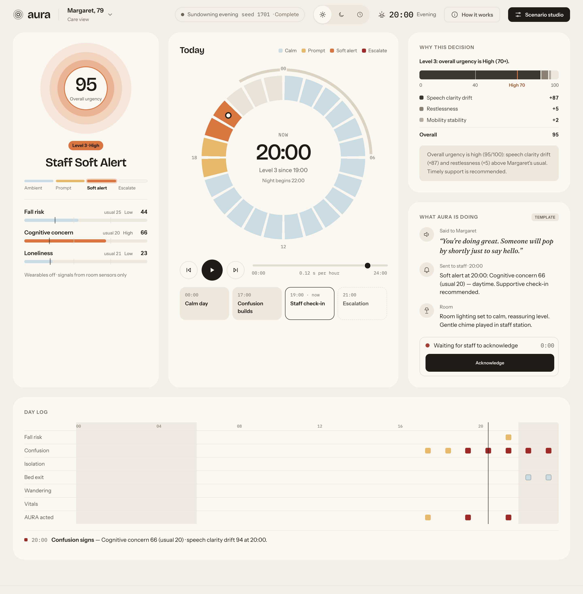

</details>

## Four residents, four stories

| Resident | Who they are | Usual (mobility · restlessness · speech drift · isolation) | Care plan |
|---|---|---|---|
| **Eleanor, 82** | Independent and steady; sleeps well | 70 · 25 · 20 · 30 | SpO2 amber < 92, red < 90 |
| **Walter, 88** | Frail and unsteady, history of falls; often up at night | 42 · 35 · 22 · 35 | Bed-exit alert · SpO2 92 / 90 |
| **Margaret, 79** | Early dementia; more restless in the evening | 62 · 32 · 45 · 30 | Bed-exit alert · SpO2 92 / 90 |
| **Joseph, 85** | Recently widowed and withdrawn; COPD, wears a monitor | 58 · 20 · 18 · 62 | Wearable · SpO2 amber < 88, red < 85 |

Each scripted story belongs to one resident and takes the ladder along a different path. Each has a fixed seed, and hits its target levels on every seed tested.

| Story | Resident | Seed | What happens | Peak |
|---|---|---|---|---|
| **Sundowning evening** | Margaret | 1701 | A calm day, then confusion and restlessness build from late afternoon into the night | Level 4 |
| **UTI onset** | Eleanor | 2402 | Sudden overnight confusion with a rising heart rate; staff respond, and she recovers by evening | Level 4 |
| **Withdrawn day** | Joseph | 3103 | Isolation creeps up and movement drops; gentle prompts all day, no staff alerts | Level 2 |
| **Restless night** | Walter | 4204 | Repeated bed exits and unsteady movement in the small hours, then a tired but calm day | Level 4 |

A **Random day** is also available for any resident. It drifts back towards their usual levels, sleeps at night with occasional wake-ups, and on some days includes a few hours when the resident is unwell. The seed is shown after the run, and typing it back in replays that day exactly.

## How it works

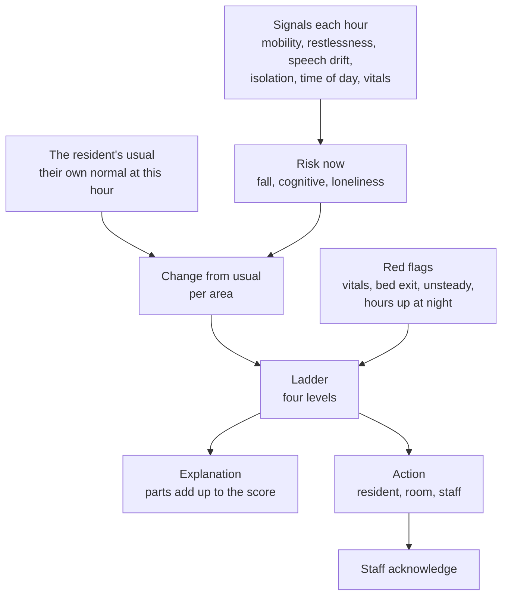

**1. Risk now.** Three areas are scored from 0 to 100 by additive formulas: fall risk, cognitive concern and loneliness. Fall risk is weighted by how much of the hour the resident is actually up. Asleep in bed, most of it goes away. Being up at night adds its own term.

**2. Change from usual.** Each area is compared with the resident's own usual score at that hour:

```text
change = 1.5 × 100 × (now − usual) ÷ max(50, 100 − usual)      (0 when at or below usual)
urgency = worst area + 0.2 × second-worst                      Low < 40 ≤ Medium < 70 ≤ High
```

The `max(50, …)` floor stops a resident with a high usual from turning small wobbles into alarms. At night, fall risk is compared with the resident's usual *when up as much as they are now*.

**3. Red flags.** Some things matter whatever a resident's normal, so they put a floor under urgency:

| Red flag | Urgency at least |
|---|---|
| Vitals outside *their own* care-plan targets | amber 40 · red 70 |
| Up at night with a care-plan bed-exit alert | 70 |
| Up at night and very unsteady (fall risk ≥ 85) | 70 |
| 2 / 3+ hours in a row out of bed at night | 40 / 70 |

**4. The ladder.**

| Level | Response | When |
|---|---|---|
| 1 · **Ambient cue** | Lighting, music | Urgency Low |
| 2 · **Gentle prompt** | A few words to the resident | Urgency Medium |
| 3 · **Staff soft alert** | A message to staff, waiting to be acknowledged | Urgency High, or amber vitals |
| 4 · **Escalate** | A priority alert to staff | Red vitals, two areas High, one area High with amber vitals, or High for 3+ hours in a row |

Staff workload never changes the level. It only adds a note to the staff message.

The full model is in **[How AURA works, and its limits](docs/how-it-works.md)**. It covers every formula and weight, the real sensor each input stands for, what is illustrative versus structural, and what it would take to make this real.

## Quick start

You need Node.js 22.12 or later.

```bash
git clone https://github.com/muratbaturay/aura.git
cd aura
npm install
npm run dev
```

Open http://localhost:5173, choose **Scenario studio**, pick a story and press **Play**.

| Script | What it does |
|---|---|
| `npm run dev` | Start the dev server with hot reload |
| `npm test` | Run the test suite once (Vitest) |
| `npm run build` | Type-check and build for production into `dist/` |
| `npm run preview` | Serve the production build |

### Adaptive messages (optional)

Resident and staff messages come from deterministic templates by default. To have them written by a language model:

1. Open **Scenario studio** → **Adaptive messages (LLM)** and turn it on.
2. Enter a base URL, model name and API key for any OpenAI-compatible endpoint, such as OpenAI, Ollama or LM Studio.
3. Press **Test connection**.

The key is stored in your browser's localStorage and is sent only to the base URL you configure. No calls are made while a day is playing, and the templates remain the fallback.

> [!CAUTION]
> AI-generated words spoken to a resident who may be confused would need clinical review and strict guardrails before any real use.

## Testing

**227 tests** across 17 files cover the scoring model and the page wiring:

- **The model:** risk terms, change-from-usual alerts, every red flag and ladder rule, per-resident vitals targets.
- **Explanations:** bar segments always add up to the score.
- **Simulation:** seeded RNG, simulation determinism, sleep and wake-ups, and every story hitting its target levels.
- **The interface:** playback, the ring, chapters, the day log lanes, staff acknowledgement and theme logic.
- **Page wiring:** jsdom tests of the resident switcher, drawers, focus handling and keyboard behaviour.
- **Documentation:** a check that [docs/how-it-works.md](docs/how-it-works.md) states exactly the formulas, ladder, red flags and residents in the code.

```bash
npm test
```

## Project structure

```text
src/
├── residents.ts        The four residents: usual levels, night habits, care-plan flags, vitals targets
├── risk.ts             Named weights and thresholds; risk terms, domain scores, urgency bands
├── assessment.ts       Change from usual, red-flag floors, the explanation behind each decision
├── intervention.ts     The four-level ladder and template messages
├── simulation.ts       Seeded 24-hour days: drift, sleep, wake-ups, unwell episodes, events
├── scenarios.ts        The four stories: keyframes, chapters, seeds
├── rng.ts              Seeded PRNG (mulberry32) and seed parsing
├── baseline.ts         Deviation from the resident's usual (z-scores)
├── howItWorks.ts       "How it works" content generated from the model's own constants
├── view.ts             View models: the halo per level, explanation bar segments
├── ring.ts             24-hour ring geometry
├── playback.ts         Playback controller: play, pause, seek, step, speed
├── chapters.ts         Story chapters: past, now, upcoming
├── lanes.ts            Day log: events grouped into lanes by hour
├── ack.ts              Staff acknowledgement (reducer and timer)
├── theme.ts            Light, dark, or follow the clock
├── chart.ts            SVG charts: usual vs now, 24-hour trends
├── main.ts             Entry point: state and wiring
├── engine/
│   └── llmMessaging.ts Optional LLM messages: prompt, debounce, abort, OpenAI-compatible client
├── ui/                 Page template, drawers, ring rendering, How it works panel, icons
└── styles/             Design tokens (light and dark) and components
docs/
├── how-it-works.md     The model, its numbers, and its limits
└── superpowers/        Design specs and implementation plans behind each feature
```

## Built with

| | |
|---|---|
| **Language** | TypeScript, strict mode, no framework |
| **Build** | Vite 7 |
| **Tests** | Vitest, with jsdom for page wiring |
| **Charts and ring** | Hand-drawn SVG |
| **Type** | [Bricolage Grotesque](https://fonts.google.com/specimen/Bricolage+Grotesque) for display, [Instrument Sans](https://fonts.google.com/specimen/Instrument+Sans) for text, [IBM Plex Mono](https://fonts.google.com/specimen/IBM+Plex+Mono) for times and scores, [Fraunces](https://fonts.google.com/specimen/Fraunces) italic only for words spoken to the resident |
| **Runtime dependencies** | None beyond the browser |

The visual language, *Dusk & Dawn*, is warm and quiet by day, and dim and amber by night. It's designed to sit on a nursing station screen at 3 a.m. without glaring.

## Limits, honestly

- **Baselines are fixed per resident**, not learned from weeks of data.
- **Nothing is calibrated to outcomes.** There are no measured false-alarm or detection rates. The scores are indices, not probabilities.
- **Inputs are simulated.** Restlessness stands in for a bed-occupancy sensor.
- **Hourly steps** simplify events that unfold in seconds (falls), over hours to days (delirium), or over weeks (isolation).
- **One ladder serves every concern.** A real deployment would route each concern to the right person.
- **Stories are scripted.** They demonstrate behaviour, not accuracy.

[What it would take to make this real →](docs/how-it-works.md#what-it-would-take-to-make-it-real)

## Releases

- **[v1.0.1](https://github.com/muratbaturay/aura/releases/tag/v1.0.1):** the *How it works, and its limits* page, in the app and in [docs](docs/how-it-works.md).
- **[v1.0.0](https://github.com/muratbaturay/aura/releases/tag/v1.0.0):** the first release: residents with their own normals, change-from-usual alerts, explainable decisions, seeded days and stories, and the Dusk & Dawn care view.

---

<div align="center">
<sub>© 2026 Murat Baturay · A prototype for demonstration and research. Not a medical device.</sub>
</div>
